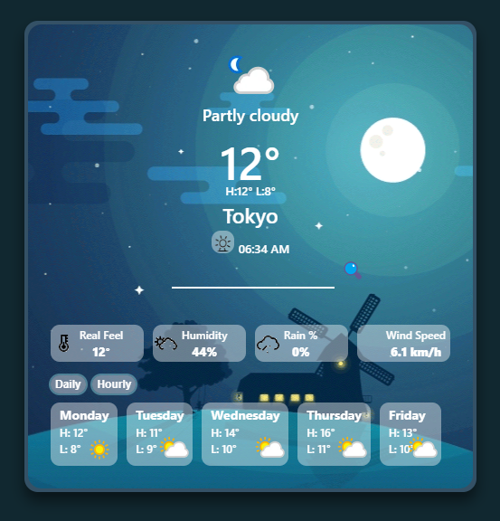
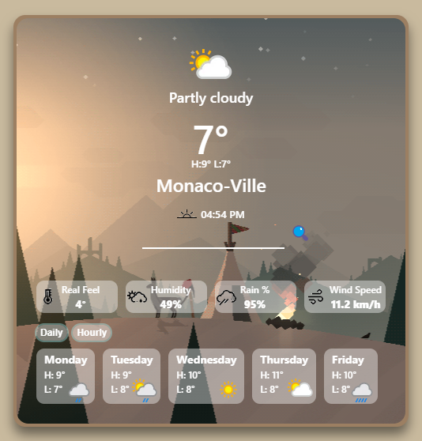
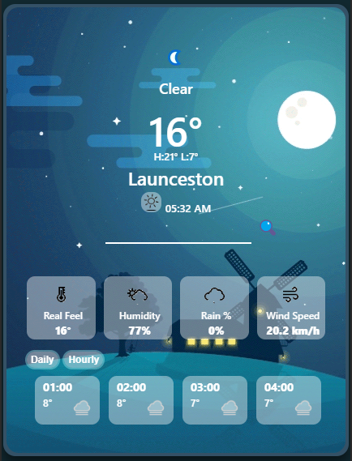

# Project: Weather App

[Live demo](https://mwahyd.github.io/weather/)

Features:

- search for a city, state or country
- get the weather metrics for searched locations
- display upcoming weather forecasts
- update the app's behaviour based on results

Tools

- javascript
- css
- html

Methods:

- use webpack to bundle the app
- use ES6: modules to partition the code
- fetch data asynchronously

Credits:

- Night background: Yup Nguyen [Dribble](https://dribbble.com/shots/2273454-Night-Hill-Animated)
- Day background: Harry Nesbitt [Dribble](https://dribbble.com/shots/1687357-All-was-calm-on-the-mountainside)
- Weather icons: [icons8](https://icons8.com/icon/set/weather/windows--animated?utm_source=dribbble&utm_medium=social&utm_campaign=weather-app)

